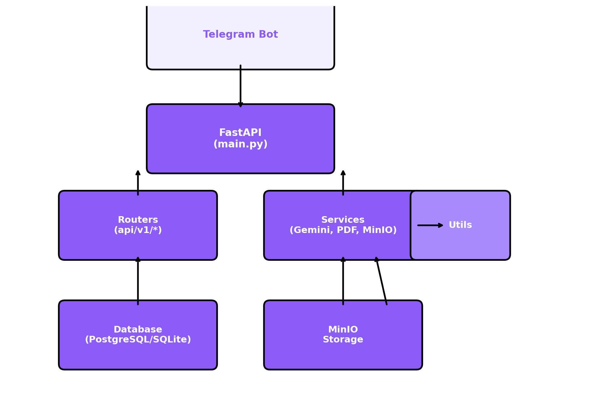

# InvoiceBot

AI-инструмент для обработки счетов в формате PDF и DOCX через Telegram-бота. Позволяет автоматически распознавать, редактировать и сохранять данные в счёте.  



## Возможности
- Загрузка PDF/DOCX через Telegram
- Распознавание ключевых полей счёта с помощью LLM
- Редактирование полей в чате
- Генерация обновленного PDF
- Хранение файлов в MinIO с presigned-ссылками

## Стек
- FastAPI + SQLAlchemy (backend)
- Aiogram 3 (бот)
- PyMuPDF (PDF)
- Google Gemini (AI)
- MinIO (хранилище)

##  Быстрый старт
```bash
# Запуск через Docker Compose (backend + MinIO)
docker-compose up --build

# Локально:
uvicorn main:app --reload        # Backend API
python bot.py                    # Telegram Bot
```

### Переменные окружения (.env):
```
BOT_TOKEN=...
API_BASE=http://localhost:8000
MINIO_ENDPOINT=localhost:9000
MINIO_ACCESS_KEY=...
MINIO_SECRET_KEY=...
MINIO_BUCKET=invoices
GEMINI_API_KEY=...
```

## Структура
```
main.py                 # Точка входа FastAPI
bot.py                  # Telegram-бот (Aiogram)
routers/                # Фичевые роутеры FastAPI (user, template, file, health)
schemas/                # Pydantic-схемы (строгая валидация)
services/               # Бизнес-логика (MinIO, Gemini, парсинг)
utils/                  # Утилиты (pdf, fonts, etc)
uploads/                # Локальные файлы пользователей
logging_conf.py         # Конфиг централизованного логгера
tests/                  # Pytest-юнит-тесты (автоматизация)
Dockerfile              # Сборка образа backend
docker-compose.yaml     # Композиция сервисов (MinIO, backend, bot)
```

## Пример использования
1. Отправьте шаблон PDF или DOCX в бота
2. Получите список полей и отредактируйте JSON
3. Получите обновлённый PDF и presigned-ссылки

---

© 2025
